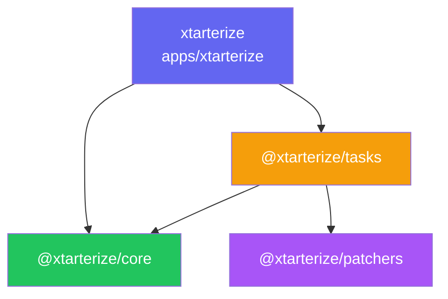
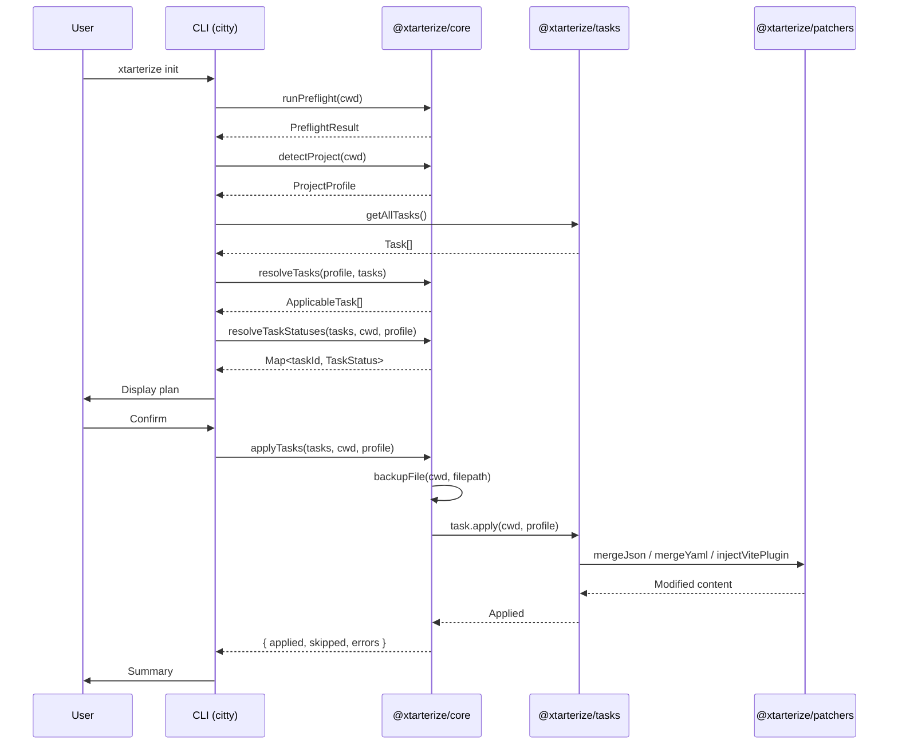
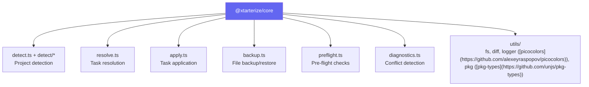
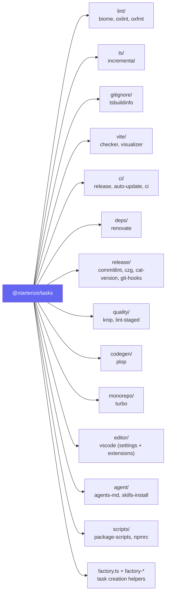

import { Aside, FileTree, Tabs, TabItem, LinkButton } from '@astrojs/starlight/components'

xtarterize is organized as a monorepo using [Turborepo](https://turbo.build/repo) for task orchestration, [pnpm](https://pnpm.io/) for package management, and [Vite Plus](https://viteplus.dev) for build, test, and development workflows.

## Package Structure

<FileTree>
- packages/
  - core/ - [`@xtarterize/core`](https://github.com/agustinusnathaniel/xtarterize/tree/main/packages/core) - [`detect.ts`](https://github.com/agustinusnathaniel/xtarterize/blob/main/packages/core/src/detect.ts) + [`detect/`](https://github.com/agustinusnathaniel/xtarterize/tree/main/packages/core/src/detect), [`resolve.ts`](https://github.com/agustinusnathaniel/xtarterize/blob/main/packages/core/src/resolve.ts), [`apply.ts`](https://github.com/agustinusnathaniel/xtarterize/blob/main/packages/core/src/apply.ts), [`backup.ts`](https://github.com/agustinusnathaniel/xtarterize/blob/main/packages/core/src/backup.ts), [`preflight.ts`](https://github.com/agustinusnathaniel/xtarterize/blob/main/packages/core/src/preflight.ts)
  - patchers/ - [`@xtarterize/patchers`](https://github.com/agustinusnathaniel/xtarterize/tree/main/packages/patchers) - [`json-merge.ts`](https://github.com/agustinusnathaniel/xtarterize/blob/main/packages/patchers/src/json-merge.ts), [`ast-patch.ts`](https://github.com/agustinusnathaniel/xtarterize/blob/main/packages/patchers/src/ast-patch.ts)
  - tasks/ - [`@xtarterize/tasks`](https://github.com/agustinusnathaniel/xtarterize/tree/main/packages/tasks) - [`factory.ts`](https://github.com/agustinusnathaniel/xtarterize/blob/main/packages/tasks/src/factory.ts), [`factory-config.ts`](https://github.com/agustinusnathaniel/xtarterize/blob/main/packages/tasks/src/factory-config.ts), [`factory-ops.ts`](https://github.com/agustinusnathaniel/xtarterize/blob/main/packages/tasks/src/factory-ops.ts), all task implementations
- apps/
  - xtarterize/ - **xtarterize** - CLI binary ([citty](https://github.com/unjs/citty) + [@clack/prompts](https://github.com/natemoo-re/clack))
  - docs/ - @xtarterize/docs - This documentation site ([Astro](https://astro.build/)/[Starlight](https://starlight.astro.build/))
- test/
  - fixtures/ - Test fixtures for various project types
</FileTree>

## Package Dependencies



<Aside>
  `@xtarterize/patchers` and `@xtarterize/core` have no internal workspace dependencies - they are leaf packages that can be used independently.
</Aside>

## How It Works



## Key Design Decisions

- **Detection lives in core** - No CLI dependency, reusable by other consumers
- **Tasks are independent** - Each task can run standalone via `add <task-id>`
- **Dry-run is exact** - `dryRun()` output is bit-for-bit identical to what `apply()` writes
- **Idempotency is non-negotiable** - Running twice produces no changes on second run
- **Templates are parameterized** - All templates receive `ProjectProfile` and adapt accordingly
- **Factory-based task creation** - Most tasks use `createFileTask`, `createJsonMergeTask`, or `createMultiFileTask` to eliminate boilerplate, with shared seams in `json-config.ts` and `ops.ts`
- **Shared command orchestration** - `init` and `sync` share a `runCommand()` helper in the CLI layer

## Core Modules



## Task Categories



## Development Workflow

<Tabs>
  <TabItem label="Setup">
    ```bash
    # Install dependencies
    vp install
    ```
  </TabItem>
  <TabItem label="Build">
    ```bash
    # Build all packages
    pnpm build
    ```
  </TabItem>
  <TabItem label="Test">
    ```bash
    # Run tests
    vp test
    ```
  </TabItem>
  <TabItem label="Check">
    ```bash
    # Format and lint with Biome
    pnpm check

    # Type check separately (Turborepo)
    pnpm typecheck
    ```
  </TabItem>
  <TabItem label="Develop">
    ```bash
    # Start development (watch mode)
    pnpm dev
    ```
  </TabItem>
</Tabs>

## Toolchain

| Tool | Purpose | Command |
|------|---------|---------|
| [Vite Plus](https://viteplus.dev) | Build, test, pack, dev server | `vp build`, `vp test`, `vp pack`, `vp dev` |
| [Turborepo](https://turbo.build/repo) | Monorepo task orchestration | `turbo run build`, `turbo run typecheck` |
| [Biome](https://biomejs.dev/) | Linting and formatting | `biome lint .`, `biome check --write .` |
| [pnpm](https://pnpm.io/) | Package management, workspaces | `pnpm install`, `catalog:` for shared deps |
| [Changesets](https://github.com/changesets/changesets) | Version management and publishing | `changeset`, `changeset version` |

## References

- [Vite Plus Documentation](https://viteplus.dev/guide/) - Unified toolchain for the web
- [Turborepo Documentation](https://turbo.build/repo/docs) - Monorepo task orchestration
- [pnpm Workspaces](https://pnpm.io/workspaces) - Workspace and monorepo management
- [citty](https://github.com/unjs/citty) - Elegant CLI framework for Node.js
- [@clack/prompts](https://github.com/natemoo-re/clack) - Interactive command-line prompts
- [Astro](https://astro.build/) - Content-focused web framework
- [Starlight](https://starlight.astro.build/) - Documentation framework for Astro
- [defu](https://github.com/unjs/defu) - Deep merge utility
- [magicast](https://github.com/unjs/magicast) - AST manipulation for JavaScript/TypeScript
- [picocolors](https://github.com/alexeyraspopov/picocolors) - Tiny terminal colors library
- [pkg-types](https://github.com/unjs/pkg-types) - Package.json type definitions and utilities

<LinkButton href="/xtarterize/contributing/core/detect/">Explore project detection →</LinkButton>
