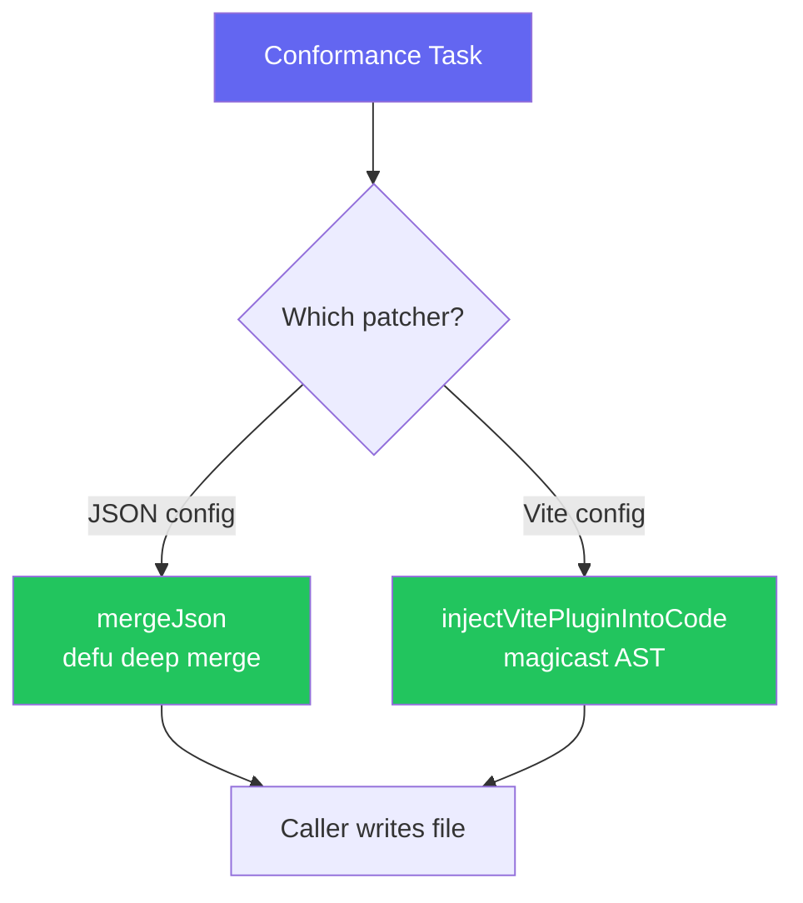

import { Aside, Steps } from '@astrojs/starlight/components'

The `@xtarterize/patchers` package provides utilities for safely modifying configuration files without overwriting existing customizations.

## Available Patchers

| Patcher | Description |
|---------|-------------|
| `mergeJson` | Deep merge JSON objects using [`defu`](https://github.com/unjs/defu) - existing keys take precedence |
| `injectVitePluginIntoCode` | AST-based plugin injection into Vite config source using [`magicast`](https://github.com/unjs/magicast) |

## Architecture



## JSON Merge

```typescript
import { mergeJson } from '@xtarterize/patchers'

const existing = { compilerOptions: { strict: true, target: "ES2022" } }
const incoming = { compilerOptions: { incremental: true, strict: true } }

const merged = mergeJson(existing, incoming)
// { compilerOptions: { strict: true, target: "ES2022", incremental: true } }
```

<Aside type="tip">
  The [`defu`](https://github.com/unjs/defu) library ensures that existing user configuration is never overwritten - incoming values only fill gaps. Learn more in the [JSON Merge](/xtarterize/contributing/patchers/json-merge/) reference.
</Aside>

## AST Patching (Vite Plugins)

```typescript
import { injectVitePluginIntoCode } from '@xtarterize/patchers'

const result = injectVitePluginIntoCode(source, {
  configPath: '/path/to/vite.config.ts',
  importPath: 'vite-plugin-checker',
  importName: 'checker',
  pluginExpression: 'checker({ typescript: true })',
})

if (!result.success) {
  console.log(result.fallback) // Manual instructions if AST structure is unsupported
}
// On success, result.generatedCode holds the transformed source: the caller writes it
```

<Steps>

1. **Parse** - Parses the Vite config source using `magicast`
2. **Check** - Checks if the plugin is already imported (idempotent)
3. **Insert import** - Inserts the import at the top of the file
4. **Append plugin** - Appends the plugin call to the `plugins` array
5. **Return** - Returns the generated source; the caller decides whether to write it

</Steps>

<Aside type="note">
  If the config structure is non-standard (factory functions, conditional exports), the AST patcher falls back to returning manual instructions rather than corrupting the file.
</Aside>

## References

- [defu](https://github.com/unjs/defu) - Deep merge utility for JavaScript objects
- [magicast](https://github.com/unjs/magicast) - AST manipulation library for JavaScript/TypeScript
- [Vite Plugin API](https://vitejs.dev/guide/api-plugin.html) - How Vite plugins work
