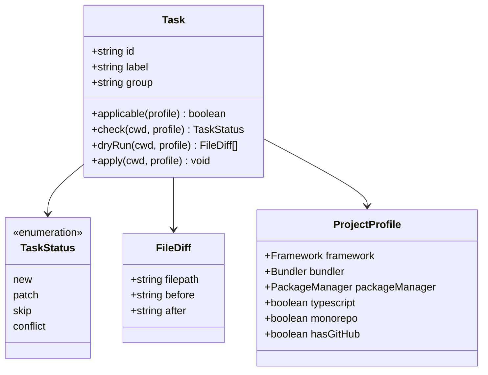

import { Aside, FileTree, LinkButton } from '@astrojs/starlight/components'

xtarterize applies conformance configuration through discrete, independently applicable tasks. This page covers the architecture and how to contribute new tasks.

## Task Interface

All tasks implement the [`Task`](https://github.com/agustinusnathaniel/xtarterize/blob/main/packages/core/src/types.ts) interface from `@xtarterize/core`:

```typescript
interface Task {
  id: string
  label: string
  group: string
  applicable: (profile: ProjectProfile) => boolean
  check: (cwd: string, profile: ProjectProfile) => Promise<TaskStatus>
  dryRun: (cwd: string, profile: ProjectProfile) => Promise<FileDiff[]>
  apply: (cwd: string, profile: ProjectProfile) => Promise<void>
}
```

## Task Architecture



## Task Directory Structure

<FileTree>
- packages/tasks/src/
  - agent/
    - skills-install.ts
  - ci/
    - auto-update.ts
    - ci.ts
    - release.ts
  - codegen/
    - plop.ts
  - deps/
    - renovate.ts
  - editor/
    - vscode.ts
  - factory-config.ts
  - factory-ops.ts
  - factory.ts
  - lint/
    - biome.ts
  - monorepo/
    - turbo.ts
  - quality/
    - knip.ts
  - release/
    - cat-version.ts
    - commitlint.ts
    - czg.ts
  - scripts/
    - package-scripts.ts
  - ts/
    - strict.ts
    - paths.ts
    - incremental.ts
    - gitignore-tsbuildinfo.ts
  - vite/
    - checker.ts
    - visualizer.ts
</FileTree>

## Task Factory

Most tasks are created through factory functions in [`factory.ts`](https://github.com/agustinusnathaniel/xtarterize/blob/main/packages/tasks/src/factory.ts) that eliminate boilerplate:

- **`createFileTask`** — For tasks that write a single file (CI workflows, [renovate](https://docs.renovatebot.com/), [commitlint](https://commitlint.js.org/), [knip](https://knip.dev/), [`.gitignore`](https://git-scm.com/docs/gitignore), `AGENTS.md`). Supports exact-match comparison with `normalizeLineEndings` and optional custom `checkFn`.
- **`createMultiFileTask`** — For tasks that write multiple text files with optional dependency install (e.g. [plop](https://plopjs.com/) writes both `plopfile.ts` and `plop/*.hbs` template files)
- **`createJsonMergeTask`** — For tasks that deep-merge JSON configs ([`tsconfig.json`](https://www.typescriptlang.org/tsconfig/), [`biome.json`](https://biomejs.dev/reference/configuration/), [`turbo.json`](https://turbo.build/repo/docs/reference/configuration)). Uses shared JSON mutation helpers in [`factory-config.ts`](https://github.com/agustinusnathaniel/xtarterize/blob/main/packages/tasks/src/factory-config.ts)
- **`createMultiFileJsonMergeTask`** — For tasks that merge multiple JSON files ([`.vscode/settings.json`](https://code.visualstudio.com/docs/getstarted/settings#_settingsjson) + [`.vscode/extensions.json`](https://code.visualstudio.com/docs/editor/extension-marketplace#_workspace-recommended-extensions)). Supports custom per-file merge functions and reuses [`factory-config.ts`](https://github.com/agustinusnathaniel/xtarterize/blob/main/packages/tasks/src/factory-config.ts)
- **`createVitePluginTask`** — For injecting plugins into [`vite.config.ts`](https://vitejs.dev/config/) ([`vite-plugin-checker`](https://vite-plugin-checker.netlify.app/checkers/typescript.html), [`rollup-plugin-visualizer`](https://github.com/btd/rollup-plugin-visualizer))
- **`createPackageJsonTask`** — For tasks that add scripts, deps, and extra files via [`package.json`](https://docs.npmjs.com/cli/v10/configuring-npm/package-json) ([`czg`](https://cz-git.qbb.sh/cli/), [`commit-and-tag-version`](https://github.com/absolute-version/commit-and-tag-version), package scripts)

This reduces most tasks from 40-80 lines to 10-15 lines of declarative configuration.

Shared implementation seams used by the factory layer:

- [`factory-config.ts`](https://github.com/agustinusnathaniel/xtarterize/blob/main/packages/tasks/src/factory-config.ts) — centralized JSON config `check`/`dryRun` logic
- [`factory-ops.ts`](https://github.com/agustinusnathaniel/xtarterize/blob/main/packages/tasks/src/factory-ops.ts) — shared dependency install and write operations
- [`agent/module.ts`](https://github.com/agustinusnathaniel/xtarterize/blob/main/packages/tasks/src/agent/module.ts) — shared agent task creation patterns

### Helper Functions

The factory provides several utilities for robust equivalence detection:

| Helper | Purpose | Used By |
|--------|---------|---------|
| `deepEqual` | Compare objects regardless of key ordering | `createJsonMergeTask`, `createMultiFileJsonMergeTask` |
| `normalizeExtends` | Normalize `"extends": "str"` to `"extends": ["str"]` | `biomeTask`, `renovateTask` |
| `normalizeLineEndings` | Convert `\r\n` to `\n` before comparison | `createFileTask` |
| `hasScriptValue` | Check if a command value already exists under any script name | `createPackageJsonTask` |

#### `normalizeExtends`

Config tools like [Renovate](https://docs.renovatebot.com/) and [Biome](https://biomejs.dev/) accept `extends` as either a string or array. `normalizeExtends` ensures both forms are treated as equivalent during comparison:

```typescript
normalizeExtends({ extends: "config:base" })
// → { extends: ["config:base"] }
```

#### `hasScriptValue`

Package script tasks skip adding a script not only when the key exists, but also when the **exact same command** already exists under a different name. This handles real-world aliases like `type:check` vs `typecheck`.

## Adding New Tasks

1. Implement the `Task` interface from `@xtarterize/core`
2. Create your task file in `packages/tasks/src/<category>/<task>.ts`
3. Export it from `packages/tasks/src/index.ts`
4. Add tests in `test/tasks/`

Each task must implement:
- `applicable(profile)` — Should this task run for this project?
- `check(cwd, profile)` — What's the current status?
- `dryRun(cwd, profile)` — What would change?
- `apply(cwd, profile)` — Make the changes

## Conflict Detection Pattern

For tasks that patch JSON config files, use a **tristate detection pattern** to avoid permanent patch loops:

| State | Condition | Status | Behavior |
|-------|-----------|--------|----------|
| **Missing** | Key does not exist | `patch` | Add the key |
| **Match** | Key exists with expected value | `skip` | No changes |
| **Mismatch** | Key exists with different value | `conflict` | Alert user, don't overwrite |

This prevents infinite loops when a user explicitly sets a value that differs from xtarterize's recommendation (e.g., [`strict: false`](https://www.typescriptlang.org/tsconfig/#strict) in tsconfig).

## References

- [defu](https://github.com/unjs/defu) — Deep merge utility used by JSON merge tasks
- [magicast](https://github.com/unjs/magicast) — AST manipulation for Vite plugin injection
- [TypeScript tsconfig](https://www.typescriptlang.org/tsconfig/) — Compiler configuration reference
- [Biome Configuration](https://biomejs.dev/reference/configuration/) — `biome.json` schema
- [Turborepo Configuration](https://turbo.build/repo/docs/reference/configuration) — `turbo.json` schema
- [commitlint Rules](https://commitlint.js.org/reference/rules.html) — Commit message validation rules
- [czg Documentation](https://cz-git.qbb.sh/cli/) — Interactive commit helper
- [commit-and-tag-version](https://github.com/absolute-version/commit-and-tag-version) — Automated versioning
- [Knip Documentation](https://knip.dev/) — Unused code detection
- [Plop Documentation](https://plopjs.com/documentation/) — Code scaffolding
- [VS Code Settings](https://code.visualstudio.com/docs/getstarted/settings) — Editor configuration
- [VS Code Extensions](https://code.visualstudio.com/docs/editor/extension-marketplace#_workspace-recommended-extensions) — Workspace recommendations
- [Renovate Configuration](https://docs.renovatebot.com/configuration-options/) — Dependency automation

<LinkButton href="/xtarterize/contributing/architecture/overview/">Learn about the overall architecture →</LinkButton>
