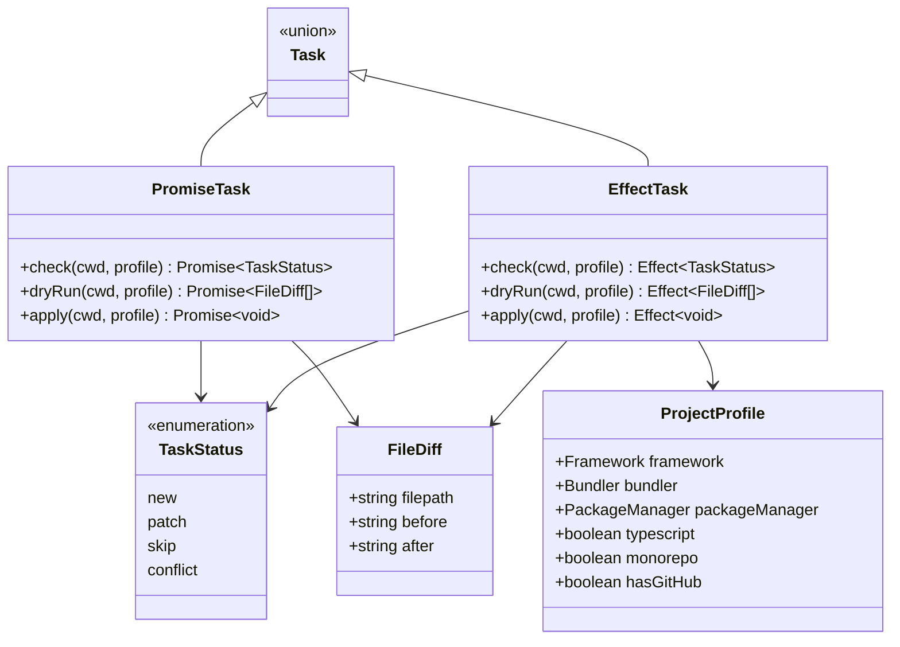

import { Aside, FileTree, LinkButton } from '@astrojs/starlight/components'

xtarterize applies conformance configuration through discrete, independently applicable tasks. This page covers the architecture and how to contribute new tasks.

## Task Interface

All tasks implement the [`Task`](https://github.com/agustinusnathaniel/xtarterize/blob/main/packages/core/src/_base.ts) contract from `@xtarterize/core`. `Task` is a union of the original Promise shape and the Effect shape first-party tasks use:

```typescript
interface TaskBase {
  id: string
  label: string
  group: string
  scope?: TaskScope           // 'root' | 'package' | 'both'
  applicable: (profile: ProjectProfile) => boolean
}

interface PromiseTask extends TaskBase {
  check: (cwd: string, profile: ProjectProfile) => Promise<TaskStatus>
  dryRun: (cwd: string, profile: ProjectProfile) => Promise<FileDiff[]>
  apply: (cwd: string, profile: ProjectProfile) => Promise<void>
  getDeps?: (cwd: string, profile: ProjectProfile) => Promise<TaskDep[]>
}

interface EffectTask extends TaskBase {
  check: (
    cwd: string,
    profile: ProjectProfile
  ) => Effect.Effect<TaskStatus, TaskError, TaskServices>
  dryRun: (
    cwd: string,
    profile: ProjectProfile
  ) => Effect.Effect<FileDiff[], TaskError, TaskServices>
  apply: (
    cwd: string,
    profile: ProjectProfile
  ) => Effect.Effect<void, TaskError, TaskServices>
  getDeps?: (
    cwd: string,
    profile: ProjectProfile
  ) => Effect.Effect<TaskDep[], TaskError, TaskServices>
}

type Task = PromiseTask | EffectTask
```

- **`Task` is a union** - First-party tasks are `EffectTask` values from `defineTask()`. External plugins may keep implementing the original Promise contract, and `toTaskEffect()` in [`task-effect.ts`](https://github.com/agustinusnathaniel/xtarterize/blob/main/packages/core/src/task-effect.ts) normalizes either shape into one Effect before the engine calls it.
- **`TaskServices`** - The runtime dependencies an Effect task may require. Today that is `ProcessRunner`, which runs external processes through a tinyexec wrapper with interruption and timeout support.
- **`scope`** - Controls where the task is offered in monorepos:
  `'root'` (monorepo root only), `'package'` (workspace packages
  only), or `'both'` (everywhere). Defaults to `'both'` when
  omitted. Ignored in non-monorepo projects.
- **`getDeps`** - Optional dependency declaration. The apply plan collects
  these across the selected tasks and installs them in one batch before any
  `apply()` runs.

## Task Architecture


```mermaid
classDiagram
    class Task {
        <<union>>
    }
    class PromiseTask {
        +check(cwd, profile) Promise~TaskStatus~
        +dryRun(cwd, profile) Promise~FileDiff[]~
        +apply(cwd, profile) Promise~void~
    }
    class EffectTask {
        +check(cwd, profile) Effect~TaskStatus~
        +dryRun(cwd, profile) Effect~FileDiff[]~
        +apply(cwd, profile) Effect~void~
    }
    class TaskStatus {
        <<enumeration>>
        new
        patch
        skip
        conflict
    }
    class FileDiff {
        +string filepath
        +string before
        +string after
    }
    class ProjectProfile {
        +Framework framework
        +Bundler bundler
        +PackageManager packageManager
        +boolean typescript
        +boolean monorepo
        +boolean hasGitHub
    }
    Task <|-- PromiseTask
    Task <|-- EffectTask
    PromiseTask --> TaskStatus
    EffectTask --> TaskStatus
    PromiseTask --> FileDiff
    EffectTask --> FileDiff
    EffectTask --> ProjectProfile
```

## Task Spec

Most tasks are declared with `defineTask()` in [`factory/define-task.ts`](https://github.com/agustinusnathaniel/xtarterize/blob/main/packages/tasks/src/factory/define-task.ts) instead of hand-writing the interface. A spec declares metadata, applicability, targets and actions, and dependencies:

```typescript
export interface TaskSpec {
  id: string
  label: string
  group: string
  scope?: TaskScope
  applicable: (profile: ProjectProfile) => boolean
  targets?: Array<TaskTarget> | TargetResolver
  actions?: Array<TaskAction>
  deps?: DepsDeclaration
  searchMeta?: SpecSearchMeta
}
```

`defineTask()` resolves the spec once per call, so `check`, `dryRun`, `apply`, and `getDeps` all project from the same resolution. Status is a projection of the resolution, not a separate `check` implementation, which is why a task can no longer report `skip` while its diffs would change.

`defineTask()` returns a `DefinedTask`, an `EffectTask` that always implements `getDeps`. Spec callbacks (targets, actions, deps, and their resolvers) accept `SpecResult<A>`, which is `A | Promise<A> | Effect.Effect<A, TaskError, TaskServices>`, so a spec can stay synchronous, return a Promise, or use services through an Effect. Failures are labeled once at the `defineTask` boundary as `<method> failed: <cause>`, matching the historical task error text.

### Target kinds

A target is one file the task claims, plus how its content is computed:

| Kind | Computes | Default status projection |
|------|----------|---------------------------|
| `text` | Rendered content with `render(profile, existing)` | absent is `new`, differing content is `conflict`, equal content is `skip` |
| `jsonMerge` | Incoming object merged into the existing JSON and patched back | absent is `new`, a real change is `patch`, no change is `skip` |
| `packageJson` | A change applied through the package.json owner | same as `jsonMerge`, plus `new` when the file is absent |
| `transform` | Content-in, content-out on a discovered file (for example a Vite config) | absent is `new` with no diff, a real change is `patch`, no change is `skip` |

Each target accepts an optional `policy` hook. It sees the same `before` and `after` pair the diff was computed from and may override the projected status, for example to force `conflict` when a user set `strict: false`.

### Actions

An action has a status probe and a run effect and produces no file diff. `agent/skills-install` is the built-in example: it reports whether the skills are installed and runs the install without pretending a log file is a config target.

### Dependencies

Dependencies are part of the resolution. A `deps` declaration is either a static `TaskDep[]` or a resolver that receives the resolved status and diffs, so a task can request a package only when the resolution will actually need it. `getDeps` is derived from that resolution.

### package.json owner

[`factory/package-json.ts`](https://github.com/agustinusnathaniel/xtarterize/blob/main/packages/tasks/src/factory/package-json.ts) is the only xtarterize writer of `package.json`. It applies a patch against the current file text, which keeps comments, indentation, and key order intact, and it recomputes the change at apply time so entries added by the package manager or by another task survive.

## Task Directory Structure

<FileTree>
- packages/tasks/src/
  - agent/
    - catalog.ts
    - skills-install.ts
  - ci/
    - auto-update.ts
    - ci.ts
    - release.ts
  - codegen/
    - plop.ts
  - deps/
    - renovate.ts
  - editor/
    - vscode.ts
  - factory/
    - define-task.ts
    - targets.ts
    - package-json.ts
    - package-scripts.ts
    - equivalence.ts
    - ops.ts
    - utils.ts
    - index.ts
  - lint/
    - biome.ts
    - oxlint.ts
  - monorepo/
    - turbo.ts
  - npmrc.ts
  - quality/
    - knip.ts
    - lint-staged.ts
  - release/
    - cat-version.ts
    - commitlint.ts
    - czg.ts
    - git-hooks.ts
  - templates/
    - agents-md.ts
    - workflows/
  - ts/
    - strict.ts
    - paths.ts
    - incremental.ts
    - gitignore-tsbuildinfo.ts
  - vite/
    - checker.ts
    - visualizer.ts
</FileTree>

## Adding New Tasks

1. Declare the task with `defineTask()` from `packages/tasks/src/factory/define-task.ts`
2. Create your task file in `packages/tasks/src/<category>/<task>.ts`
3. Export it from `packages/tasks/src/index.ts` and register it in `getAllTasks()`
4. Add or update tests only when they provide meaningful regression protection. Extend the nearest existing suite when possible; see the repository [`docs/TESTING.md`](https://github.com/agustinusnathaniel/xtarterize/blob/main/docs/TESTING.md)

A minimal spec looks like this:

```typescript
import { defineTask } from '@/factory/define-task.js'

export const myTask = defineTask({
  applicable: (profile) => profile.typescript,
  group: 'TypeScript',
  id: 'ts/example',
  label: 'Example TypeScript config',
  targets: [
    {
      filepath: 'tsconfig.json',
      kind: 'jsonMerge',
      incoming: () => ({ compilerOptions: { noUncheckedIndexedAccess: true } }),
    },
  ],
})
```

## Helper Functions

The task layer provides shared helpers for robust equivalence detection:

| Helper | Purpose | Location |
|--------|---------|----------|
| `normalizeLineEndings` | Convert `\r\n` to `\n` before comparison | `factory/utils.ts` |
| `resolveTaskFile` | Find a config file across declared extensions | `factory/utils.ts` |
| `hasScriptWithEquivalentValue` | Check if an equivalent command already exists under another script name | `factory/equivalence.ts` |

## Conflict Detection Pattern

Targets that patch JSON config files project a **tristate** status to avoid permanent patch loops:

| State | Condition | Status | Behavior |
|-------|-----------|--------|----------|
| **Missing** | Key does not exist | `new` | Add the key |
| **Match** | Key exists with expected value | `skip` | No changes |
| **Mismatch** | Key exists with different value | `conflict` | Alert user, don't overwrite |

For mismatches that must never be overwritten (for example `strict: false` in tsconfig), the target's `policy` hook forces `conflict` explicitly. This prevents infinite loops when a user deliberately sets a value that differs from xtarterize's recommendation.

## References

- [defu](https://github.com/unjs/defu) - Deep merge utility used by JSON merge targets
- [magicast](https://github.com/unjs/magicast) - AST manipulation for Vite plugin injection
- [TypeScript tsconfig](https://www.typescriptlang.org/tsconfig/) - Compiler configuration reference
- [Biome Configuration](https://biomejs.dev/reference/configuration/) - `biome.json` schema
- [Turborepo Configuration](https://turbo.build/repo/docs/reference/configuration) - `turbo.json` schema
- [commitlint Rules](https://commitlint.js.org/reference/rules.html) - Commit message validation rules
- [czg Documentation](https://cz-git.qbb.sh/cli/) - Interactive commit helper
- [commit-and-tag-version](https://github.com/absolute-version/commit-and-tag-version) - Automated versioning
- [Knip Documentation](https://knip.dev/) - Unused code detection
- [Plop Documentation](https://plopjs.com/documentation/) - Code scaffolding
- [VS Code Settings](https://code.visualstudio.com/docs/getstarted/settings) - Editor configuration

<LinkButton href="/xtarterize/contributing/architecture/overview/">Learn about the overall architecture →</LinkButton>
