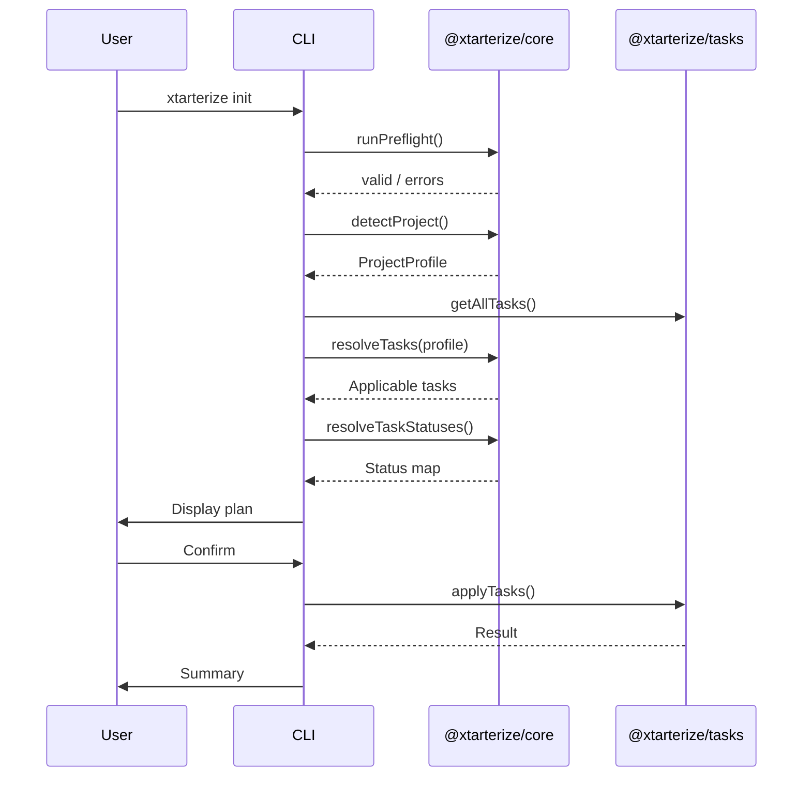

import { Aside, Steps, Tabs, TabItem } from '@astrojs/starlight/components'

## Initialize a Project

To apply conformance configuration to a project:

```bash
npx xtarterize init
```

<Steps>

1. **Scan** your project directory to detect framework, bundler, package manager, monorepo status, and existing configs
2. **Resolve** which conformance tasks are applicable for your stack
3. **Check** each task's current status (`new`, `patch`, `skip`, or `conflict`)
4. **Display** a conformance plan table showing what will change
5. **Prompt** you to apply all, select specific tasks, dry-run, or quit

</Steps>

## Example Output

```
✦ Scanning project...

  Detected:
    Framework:   React 18
    Bundler:     Vite 5
    Package Manager: pnpm

  Conformance plan:

    ✔ Biome (lint + format)              lint/biome           [new]
    ✔ vite-plugin-checker                vite/checker         [new]
    ~ tsconfig — incremental: true       ts/incremental       [patch]
    = Turbo                              monorepo/turbo       [skip — no monorepo]

  [A] Apply all   [S] Select items   [D] Dry-run   [Q] Quit
```

## Options

| Flag | Description |
|------|-------------|
| `--dry-run` | Preview all changes without applying anything |
| `--yes` | Skip all confirmations, apply all changes automatically |
| `--skip <task-id>` | Exclude a specific task (comma-separated) |
| `--only <task-id>` | Apply only a specific task (comma-separated) |
| `--quiet` | Suppress interactive prompts and verbose output |

## Examples

<Tabs>
  <TabItem label="Preview">
    ```bash
    npx xtarterize init --dry-run
    ```
  </TabItem>
  <TabItem label="Apply all">
    ```bash
    npx xtarterize init --yes
    ```
  </TabItem>
  <TabItem label="Skip tasks">
    ```bash
    npx xtarterize init --skip codegen/plop,agent/skills-install
    ```
  </TabItem>
  <TabItem label="Only specific">
    ```bash
    npx xtarterize init --only lint/biome
    ```
  </TabItem>
</Tabs>

## What Gets Applied

The `init` command applies all tasks that are applicable to your detected stack:

- **Linting & Formatting** — [Biome](https://biomejs.dev/) (non-Vite+) or [Oxlint](https://oxc.rs/) + [Oxfmt](https://oxc.rs/) (Vite+), with [Ultracite](https://ultracite.ai/) presets installed automatically and configs extended/imported from Ultracite
- **TypeScript** — [`strict: true`](https://www.typescriptlang.org/tsconfig/#strict), [`paths`](https://www.typescriptlang.org/tsconfig/#paths) aliases, [`incremental: true`](https://www.typescriptlang.org/tsconfig/#incremental) + [`tsBuildInfoFile`](https://www.typescriptlang.org/tsconfig/#tsBuildInfoFile), [`.gitignore`](https://git-scm.com/docs/gitignore) `*.tsbuildinfo` entries
- **Vite Plugins** — [`vite-plugin-checker`](https://vite-plugin-checker.netlify.app/) ([`checker()`](https://vite-plugin-checker.netlify.app/checkers/typescript.html) for TypeScript), [`rollup-plugin-visualizer`](https://github.com/btd/rollup-plugin-visualizer)
- **CI/CD** — [GitHub Actions](https://docs.github.com/en/actions/using-workflows/workflow-syntax-for-github-actions) workflows ([`on.push.tags`](https://docs.github.com/en/actions/using-workflows/events-that-trigger-workflows#running-your-workflow-when-a-push-of-a-specific-tag-occurs) for release, [`schedule.cron`](https://docs.github.com/en/actions/using-workflows/events-that-trigger-workflows#schedule) for auto-updates, [`on.pull_request`](https://docs.github.com/en/actions/using-workflows/events-that-trigger-workflows#pull_request) for CI) with [`pnpm/action-setup@v4`](https://github.com/pnpm/action-setup) for pnpm projects
- **Dependencies** — [Renovate](https://docs.renovatebot.com/) config ([`extends: config:base`](https://docs.renovatebot.com/presets-config/#configbase), [`automerge`](https://docs.renovatebot.com/key-concepts/automerge/))
- **Release** — [Commitlint](https://commitlint.js.org/) ([`@commitlint/config-conventional`](https://commitlint.js.org/reference/rules.html)), [czg](https://cz-git.qbb.sh/cli/) ([`commitizen`](https://commitizen.github.io/cz-cli/)), [commit-and-tag-version](https://github.com/absolute-version/commit-and-tag-version)
- **Quality** — [Knip](https://knip.dev/) ([`entry`](https://knip.dev/reference/configuration#entry) / [`project`](https://knip.dev/reference/configuration#project) detection)
- **Codegen** — [Plop](https://plopjs.com/) ([`plopfile.ts`](https://plopjs.com/documentation/#getting-started) scaffolds, only for projects with a detected framework)
- **Monorepo** — [Turborepo](https://turbo.build/repo/docs/reference/configuration) ([`turbo.json`](https://turbo.build/repo/docs/reference/configuration) pipeline)
- **Editor** — [VS Code](https://code.visualstudio.com/) [`settings.json`](https://code.visualstudio.com/docs/getstarted/settings#_settingsjson) and [`extensions.json`](https://code.visualstudio.com/docs/editor/extension-marketplace#_workspace-recommended-extensions) (additive merging preserves your existing extensions)
- **Agent** — `AGENTS.md` and install relevant [agent skills](https://skills.sh) via `npx skills@latest add` for your detected stack
- **Scripts** — [`package.json` `scripts`](https://docs.npmjs.com/cli/v10/using-npm/scripts) (uses [Ultracite](https://www.ultracite.ai/)-aware lint/check/fix scripts when Ultracite is in dependencies)

<Aside>
  Each task checks if it's already applied and skips if conformant. Running `init` twice produces no changes on the second run.
</Aside>

## Ultracite

[Ultracite](https://ultracite.ai/) is installed automatically alongside any lint tool (Biome, Oxlint, or Oxfmt). The generated configs extend or import Ultracite presets by default — no separate `ultracite init` step needed.

xtarterize overlays its own conventions on top of Ultracite defaults where they differ (e.g., kebab-case filenames, single quotes, generic array types). You can further customize by editing the generated config files directly.

## References

- [Biome Configuration](https://biomejs.dev/reference/configuration/) — Full `biome.json` reference
- [TypeScript tsconfig Reference](https://www.typescriptlang.org/tsconfig/) — All compiler options explained
- [Vite Plugin Checker](https://vite-plugin-checker.netlify.app/) — Type-checking during development
- [GitHub Actions Documentation](https://docs.github.com/en/actions) — Workflow syntax and features
- [Renovate Configuration Options](https://docs.renovatebot.com/configuration-options/) — Dependency automation reference
- [Commitlint Rules](https://commitlint.js.org/reference/rules.html) — Conventional commit validation
- [Knip Documentation](https://knip.dev/) — Finding unused files, dependencies, and exports
- [Plop Documentation](https://plopjs.com/documentation/) — Code scaffolding and generators
- [Turborepo Documentation](https://turbo.build/repo/docs) — Monorepo task orchestration
- [Ultracite](https://www.ultracite.ai/) — Strict Biome preset for code quality
- [Agent Skills](https://skills.sh) — Open ecosystem of reusable AI agent capabilities

## Init Flow


