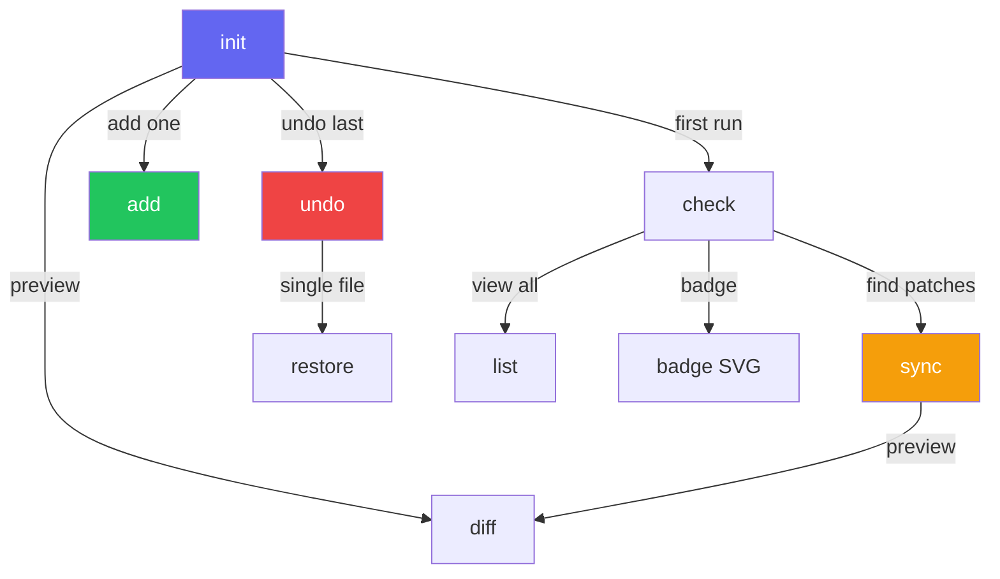

import { Aside, Tabs, TabItem, LinkButton } from '@astrojs/starlight/components'

The xtarterize CLI provides commands to detect, apply, and maintain conformance configuration for [JavaScript](https://developer.mozilla.org/en-US/docs/Web/JavaScript)/[TypeScript](https://www.typescriptlang.org/) projects.

## Global Options

| Option | Description |
|--------|-------------|
| `--cwd <path>` | Target directory (default: current working directory) |
| `--json` | Output machine-readable JSON |
| `--timing` | Show detailed per-task timing breakdown |
| `--help` | Show help for a command |
| `--version` | Show version number |

## Available Commands

| Command | Description |
|---------|-------------|
| [`xtarterize init`](#init) | Full conformance setup - detect, plan, apply |
| [`xtarterize sync`](#sync) | Update existing configs to latest templates |
| [`xtarterize diff`](#diff) | Show pending changes without applying |
| [`xtarterize check`](#check) | Audit current conformance status |
| [`xtarterize doctor`](#doctor) | Run environment, tools, and project diagnostics |
| [`xtarterize add [task-id]`](#add) | Apply a single task, or pick interactively |
| [`xtarterize undo`](#undo) | Undo the last run by restoring backed-up files |
| [`xtarterize restore <file>`](#restore) | Restore a file from backup |
| [`xtarterize list`](#list) | List all available tasks with status |
| [`xtarterize query`](#query) | Search tasks by natural language query |

## `doctor`

Run comprehensive project diagnostics. Checks are grouped into four categories:

| Group | Checks |
|-------|--------|
| **Environment** | Node.js version against `engines.node`, Git installation |
| **Tools** | Required tools from `package.json` are installed (with version info) |
| **Project** | Lockfile, `tsconfig.json`, `README.md`, `.gitignore` |
| **Configuration** | Conflicting tool detection (e.g., Biome + ESLint/Prettier) |

### Options

| Option | Description |
|--------|-------------|
| `--verbose` | Show system information (OS, architecture, CPU count, RAM) |
| `--quiet` | Suppress detailed output, show summary only |
| `--json` | Output machine-readable JSON diagnostics |

```bash
npx xtarterize doctor
npx xtarterize doctor --verbose
```

With `--verbose`, a **System** group is added displaying platform, OS release, architecture, CPU count, and RAM:

```
  System
    ✅ Platform | Linux 6.8.0 | x64 | 16 CPUs | 32 GB RAM

  Environment
    ✅ Node.js 22.14.0 satisfies engines.node ^22.0.0
    ✅ Git 2.43.0 is installed

  Tools
    ✅ TypeScript 5.7.3 is installed
    ✅ Biome 1.9.4 is installed

  Project
    ✅ pnpm-lock.yaml exists
    ✅ tsconfig.json exists
    ⚠ README.md is missing

  Configuration
    ✅ No conflicting tools detected
```

All diagnostics also support `--json` for machine-readable output.

## `init`

Full conformance setup. Detects your project stack, shows a plan, and applies changes.

### Options

| Option | Description |
|--------|-------------|
| `--dry-run` | Preview all changes without applying |
| `--yes` | Skip all confirmations, apply all changes automatically |
| `--compose <query>` | Rank tasks by relevance to a natural language query |
| `--skip <task-id>` | Exclude a specific task (comma-separated) |
| `--only <task-id>` | Apply only a specific task (comma-separated) |
| `--quiet` | Suppress interactive prompts and verbose output |
| `--format <format>` | Output format (`terminal` or `json`) |
| `--timing` | Show detailed per-task timing breakdown |

<Tabs>
  <TabItem label="Basic">
    ```bash
    npx xtarterize init
    ```
  </TabItem>
  <TabItem label="Dry run">
    ```bash
    npx xtarterize init --dry-run
    ```
  </TabItem>
  <TabItem label="Auto-apply">
    ```bash
    npx xtarterize init --yes
    ```
  </TabItem>
  <TabItem label="Skip tasks">
    ```bash
    npx xtarterize init --skip lint/oxlint
    ```
  </TabItem>
  <TabItem label="Only specific">
    ```bash
    npx xtarterize init --only lint/biome,ts/incremental
    ```
  </TabItem>
</Tabs>

## `sync`

Update existing project configs to match the latest conformance templates. Only shows tasks with `patch` or `conflict` status.

### Options

| Option | Description |
|--------|-------------|
| `--dry-run` | Preview changes without applying |
| `--yes` | Skip all confirmations, apply all updates automatically |
| `--skip <task-id>` | Exclude a specific task (comma-separated) |
| `--only <task-id>` | Apply only a specific task (comma-separated) |
| `--quiet` | Suppress interactive prompts and verbose output |
| `--format <format>` | Output format (`terminal` or `json`) |
| `--timing` | Show detailed per-task timing breakdown |

```bash
npx xtarterize sync
npx xtarterize sync --dry-run
npx xtarterize sync --yes
```

<Aside type="note">
  Unlike `init`, `sync` only targets tasks with `patch` or `conflict` status. It won't re-apply already conformant configs.
</Aside>

## `diff`

Show pending changes for all tasks with `new`, `patch`, or `conflict` status, without applying anything. Read-only. Uses [unified diffs](https://www.gnu.org/software/diffutils/manual/html_node/Unified-Format.html) for patch comparisons.

### Options

| Option | Description |
|--------|-------------|
| `--quiet` | Suppress verbose output |
| `--format <format>` | Output format (`terminal` or `json`) |

```bash
npx xtarterize diff
```

<Aside type="tip">
  The <code>diff</code> command shows full file contents for <code>new</code> tasks (files that don't exist yet) and [unified diffs](https://www.gnu.org/software/diffutils/manual/html_node/Detailed-Unified.html) for <code>patch</code> tasks (existing files that need updates).
</Aside>

<Aside type="note">
  When multiple tasks modify the same JSON file (e.g., <code>tsconfig.json</code>), <code>diff</code> merges their changes into a single unified diff so you see the complete intended state rather than overlapping individual patches.
</Aside>

## `check`

Audit which tasks are conformant and which need attention. Also runs diagnostics for conflicting tools and missing installations.

### Options

| Option | Description |
|--------|-------------|
| `--verbose` | Show tool installation and conflict checks |
| `--quiet` | Suppress verbose output |
| `--badge <path>` | Generate a conformance badge SVG (use `-` for stdout) |

```bash
npx xtarterize check
npx xtarterize check --verbose
npx xtarterize check --badge conformance.svg
```

Output shows:

| Icon | Status | Meaning |
|------|--------|---------|
| ✔ | `skip` | Conformant - no action needed |
| ~ | `patch` | Needs update - will be patched |
| ✗ | `new` | Missing entirely - will be created |
| ⚠ | `conflict` | Incompatible config - needs manual resolution |

In verbose mode, `check` also displays diagnostics for:
- **Conflicting tools** - Biome + ESLint/Prettier detected together
- **Legacy configs** - ESLint flat config migration recommendations
- **Tool installations** - Tools in package.json but not installed locally

## `add`

Apply a single conformance task, or pick interactively from a grouped menu.

When called **with a task ID**, applies that specific task after showing a diff preview and confirmation. When called **without a task ID**, shows a grouped multi-select menu of all applicable tasks with their current status.

### Options

| Option | Description |
|--------|-------------|
| `--quiet` | Suppress interactive prompts |
| `--format <format>` | Output format (`terminal` or `json`) |
| `--timing` | Show detailed per-task timing breakdown |
| `--all` | Apply all applicable new and patch tasks without interaction |

<Tabs>
  <TabItem label="Specific task">
    ```bash
    npx xtarterize add lint/biome
    npx xtarterize add ci/release
    ```
  </TabItem>
  <TabItem label="Interactive">
    ```bash
    npx xtarterize add
    ```
    Browse tasks by category, select multiple, and apply with per-task confirmation.
  </TabItem>
  <TabItem label="All tasks">
    ```bash
    npx xtarterize add --all
    ```
    Apply all applicable new and patch tasks in one pass with no interaction.
  </TabItem>
</Tabs>

## `undo`

Undo the last `init`, `sync`, or `add` run by restoring all files that were backed up. Reads the run manifest (`.xtarterize/backups/last-run.json`) written during apply to identify which files to restore.

### Options

| Option | Description |
|--------|-------------|
| `--quiet` | Skip confirmation prompt |

```bash
npx xtarterize undo
```

<Aside type="tip">
  The <code>undo</code> command restores all files from the most recent run in one step. For single-file restores, use <code>xtarterize restore &lt;file&gt;</code> instead.
</Aside>

## `restore`

Restore a file from a previous backup. If multiple backups exist, you'll be prompted to select one. Use `--yes` to automatically restore the latest backup without prompting.

### Arguments

| Argument | Required | Description |
|----------|----------|-------------|
| `filepath` | Yes | Path to the file to restore |

### Options

| Option | Description |
|--------|-------------|
| `--yes` | Skip confirmation, restore latest backup when multiple exist |
| `--quiet` | Suppress verbose output |

```bash
npx xtarterize restore tsconfig.json
npx xtarterize restore biome.json --yes
npx xtarterize restore tsconfig.json --quiet
```

## `list`

List all registered tasks grouped by category, with current status.

### Options

| Option | Description |
|--------|-------------|
| `--quiet` | Suppress verbose output |

```bash
npx xtarterize list
```

## `query`

Search tasks by natural language query. No need to remember exact task IDs - just describe what you're looking for.

### Options

| Option | Description | Default |
|--------|-------------|---------|
| `--limit <n>` | Maximum number of results to show | `20` |
| `--threshold <n>` | Minimum relevance score (0-1) | `0.1` |
| `--json` | Output machine-readable JSON | `false` |

```bash
npx xtarterize query "strict typescript"
npx xtarterize query "ci pipeline" --json
npx xtarterize query "linting and formatting tool" --limit 5
```

<Aside type="tip">
  For a full reference, see the [query command page](/xtarterize/guide/cli/query/).
</Aside>

## Task Status Values

Each task reports one of four statuses:

| Status | Meaning |
|--------|---------|
| `new` | File/config doesn't exist yet |
| `patch` | File exists but needs additions/updates |
| `skip` | Already conformant, nothing to do |
| `conflict` | Existing config is incompatible; requires decision |

## Backup System

Before any file is modified, xtarterize creates a timestamped backup in `.xtarterize/backups/`. A run manifest (`last-run.json`) is also written so `undo` can restore all files from a run in one step. The `.xtarterize/` directory is automatically added to your project's `.gitignore`, keeping internal artifacts out of version control.

<Aside type="tip">
  Backups are stored with timestamps in `.xtarterize/backups/` and indexed in `.xtarterize/backups/.index.json`. Use <code>xtarterize undo</code> to revert an entire run, or <code>xtarterize restore &lt;file&gt;</code> to revert a single file.
</Aside>

## Command Relationships



## References

- [GNU Diff Unified Format](https://www.gnu.org/software/diffutils/manual/html_node/Detailed-Unified.html) - How unified diffs work
- [GitHub Actions Documentation](https://docs.github.com/en/actions) - CI/CD workflow reference

<LinkButton href="/xtarterize/guide/tasks/overview/">Explore conformance tasks →</LinkButton>
