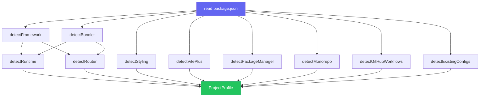

import { Aside, Tabs, TabItem } from '@astrojs/starlight/components'
import AllPackageManagers from '@/components/AllPackageManagers.astro'

xtarterize doesn't require a config file. It detects your project's stack automatically and applies only what's appropriate.

## Detection

When you run `init`, xtarterize scans `package.json`, lockfiles, config files, and directories to build a `ProjectProfile` covering framework, bundler, router, styling, package manager, monorepo status, GitHub, and existing configs. See [Project detection](/xtarterize/contributing/core/detect/) for the full profile schema and precedence rules.

## Detection Flow



## Detection Sources

<Tabs>
  <TabItem label="package.json">
    Framework, bundler, router, styling, and TypeScript are all detected from [`dependencies`](https://docs.npmjs.com/cli/v10/configuring-npm/package-json#dependencies) and [`devDependencies`](https://docs.npmjs.com/cli/v10/configuring-npm/package-json#devdependencies).
  </TabItem>
  <TabItem label="Lock files">
    Package manager is detected from lock file presence: [`pnpm-lock.yaml`](https://pnpm.io/), [`yarn.lock`](https://yarnpkg.com/features/zero-installs), [`package-lock.json`](https://docs.npmjs.com/cli/v10/configuring-npm/package-lock-json), [`bun.lock`](https://bun.sh/docs/install/lockfile), or `bun.lockb`.
  </TabItem>
  <TabItem label="File system">
    Monorepo status, GitHub, and existing configs are detected by checking for specific files and directories.
  </TabItem>
</Tabs>

## Framework Precedence

<Aside type="note">
  If both `react` and `react-native` (or `expo`) are detected, xtarterize treats the project as React Native. There is no prompt to clarify the framework.
</Aside>

## Task Gating

Tasks are gated on the detected profile:

- Vite plugin tasks only run for browser Vite projects (`bundler === 'vite'` and `runtime !== 'node'`)
- Monorepo tasks only run when `monorepo === true`
- CI tasks only run when `hasGitHub === true`
- TypeScript tasks only run when `typescript === true`

### Monorepo scope filtering

In monorepos, tasks are additionally filtered by their scope (`root`, `package`, or `both`). See the [Monorepo guide](/xtarterize/guide/monorepo/) for the scope table and filtering rules.

## Parameterized Templates

All templates adapt to the detected profile:

- GitHub workflows use the detected package manager for install commands
- Knip entry points are inferred from the bundler/framework
- Plop generators vary by framework (React gets component+hook, Vue gets component+composable, etc.)
- VS Code extensions include framework-specific recommendations
- AGENTS.md includes framework-specific instructions

## Backup System

Before any file is modified, xtarterize creates a timestamped backup in `.xtarterize/backups/`. An index file tracks all backups for easy restoration.

The `.xtarterize/` directory is automatically added to your project's `.gitignore` when you run any `xtarterize` command. You won't see these internal artifacts in `git status`.

Restore with:

<AllPackageManagers type="exec" pkg="xtarterize@latest" args="restore tsconfig.json" />

## Task selection

`.xtarterizerc` accepts `skip` and `only` arrays so repeat runs apply the same filter without CLI flags. The same fields work in the `"xtarterize"` key of `package.json`.

```json
{
  "skip": ["agent/skills-install"],
  "only": ["ts/strict", "lint/biome"]
}
```

Precedence rules:

- CLI `--only` overrides the config `only` list when provided
- CLI `--skip` extends the config `skip` list
- A task in both `skip` and `only` is excluded - skip wins
- An empty or absent `only` list means no restriction, not "apply nothing"

For command behavior, see the [CLI reference](/xtarterize/guide/cli/overview/).
For generated files, see the [task catalog](/xtarterize/guide/tasks/overview/).
